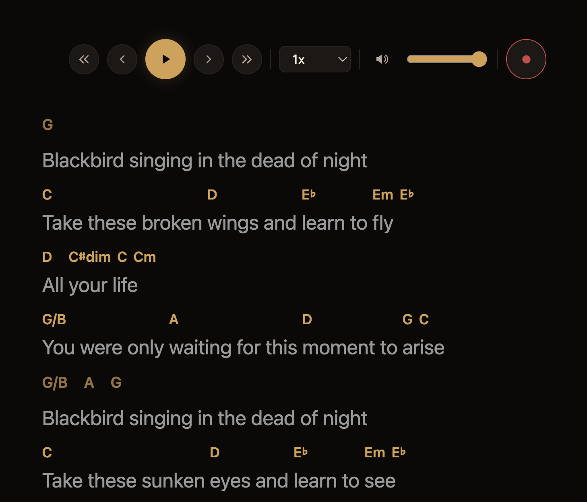
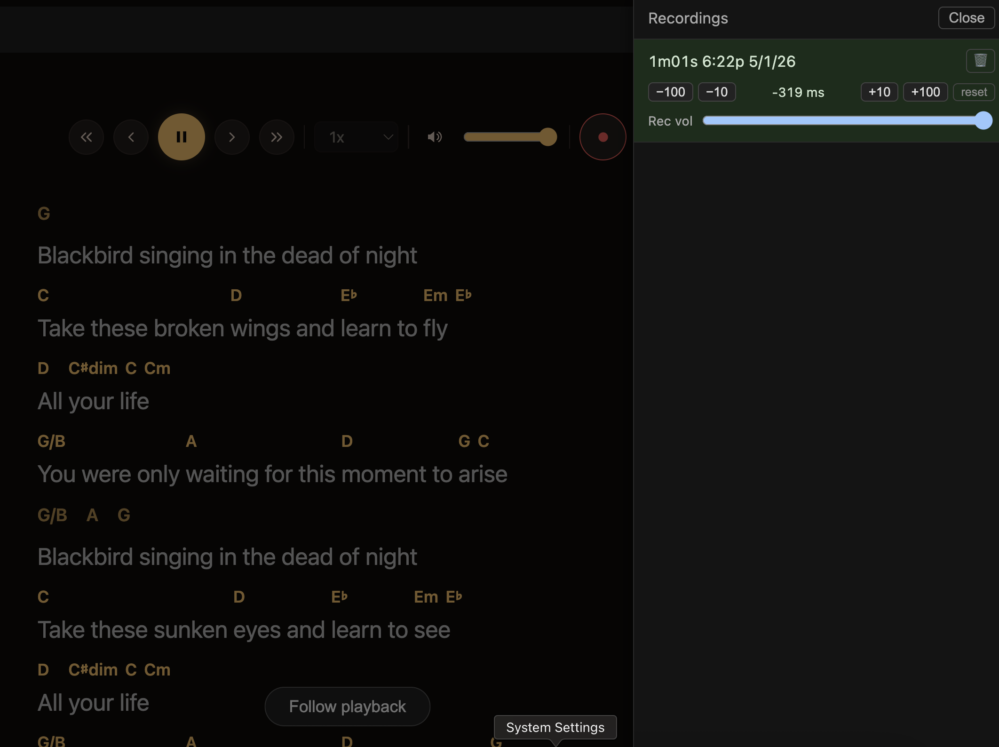

# PulseGuide

[](https://github.com/hartphoenix/pulsemap)

Synced lead-sheet player for the [PulseMap](https://github.com/hartphoenix/pulsemap) protocol — chord charts and lyrics for any mapped song, in real time.

**Live at <https://hartphoenix.github.io/pulseguide/>.** Pick any song from the catalog to try it.





## What it does

PulseGuide reads a PulseMap, fetches the underlying audio (currently YouTube; soon also any local audio file via the upstream `HtmlAudioAdapter`), and renders a synchronized lead sheet:

- **Synced lyrics** with word-level karaoke highlighting
- **Chord-over-word alignment** — chord names positioned above the word where the change falls
- **Section labels** in the left margin (verse, chorus, bridge…)
- **Measure charts** with bar lines for instrumental passages
- **Click-to-seek** at word granularity
- **Record audio over a map** (microphone capture, IndexedDB persistence, ear-nudge sync)
- **Right-click to correct** any chord, lyric, word, or section — opens the upstream PulseMap editor with the right context selected
- **Responsive layout** — portrait (book feel) and landscape (video + lyrics side by side); iPad Safari compatible

## What's coming next

- **Drop a local audio file** — drag an MP3 in, pick a map, see the lead sheet for it. Depends on the upstream `HtmlAudioAdapter` landing on PulseMap main.
- **Chrome extension MVP** (`extension/` scaffold) — detect the active YouTube tab, deep-link to PulseGuide if a map exists for that video.

## Use it

```bash
bun install
bun run dev          # http://localhost:5173
bun run typecheck
bun run lint
bun test
```

The dev server serves map files from `../pulsemap/maps/` directly. For local development against a checkout of pulsemap, symlink it in:

```bash
rm -rf node_modules/pulsemap
ln -s ../pulsemap node_modules/pulsemap
```

## How it relates to PulseMap

PulseGuide is **a consumer** of the PulseMap protocol, not part of it. PulseMap defines the map format, the SDK adapters, and the Map Editor; PulseGuide imports the SDK directly via `pulsemap/sdk` (installed from `github:hartphoenix/pulsemap`) and renders one specific kind of view — a lead sheet — over the data. Other consumers can render entirely different things from the same maps; that's the protocol working as intended.

If you're looking for the protocol itself: <https://github.com/hartphoenix/pulsemap>.

## License

MIT
